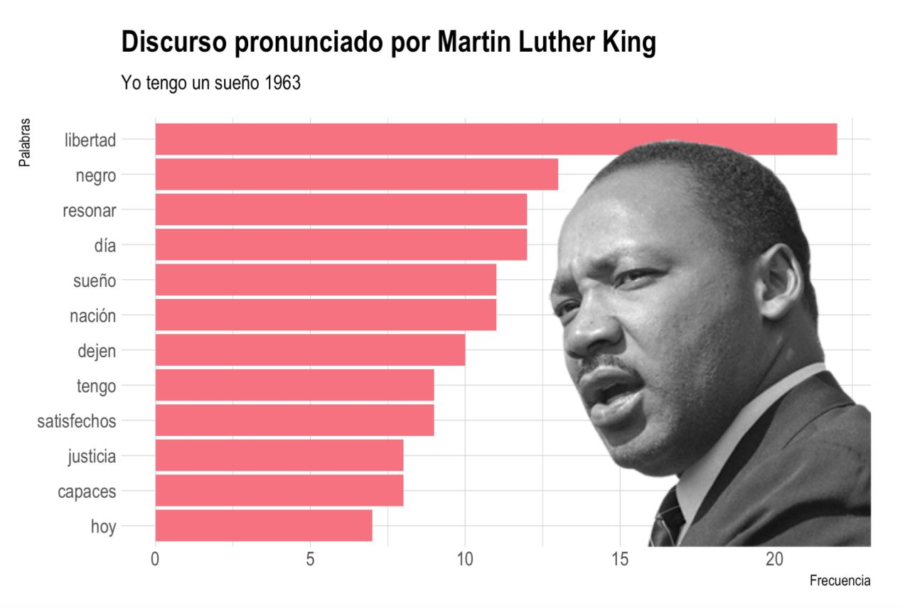
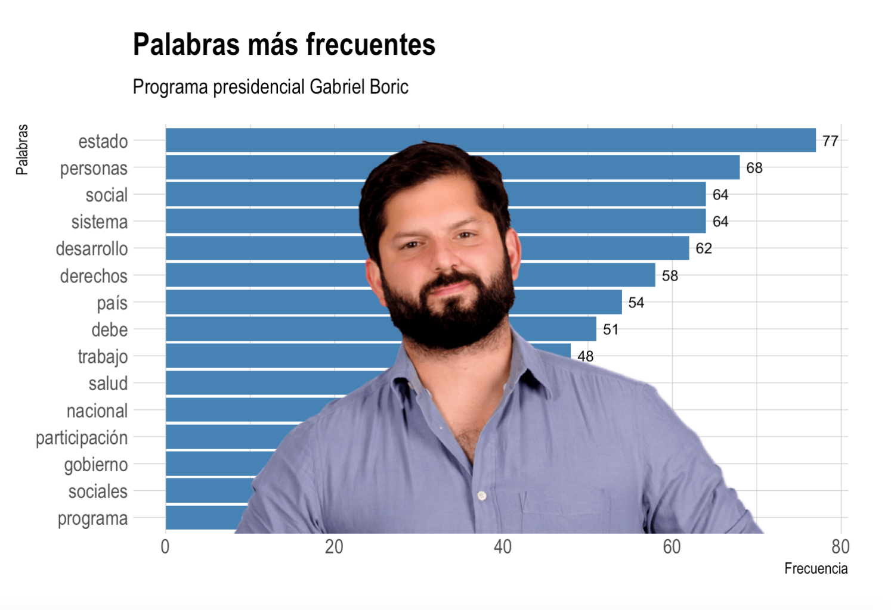
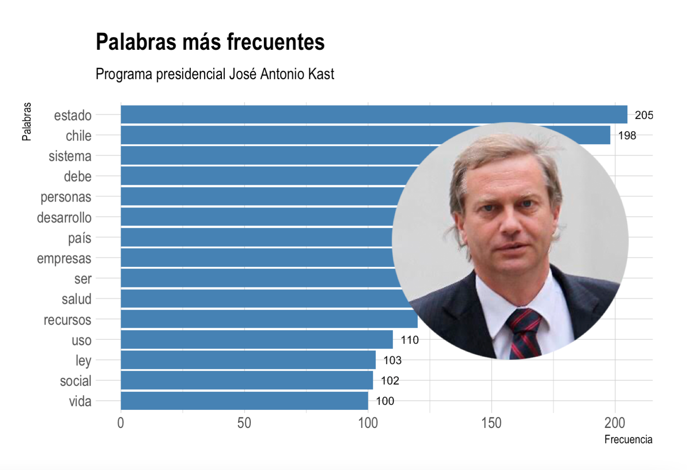
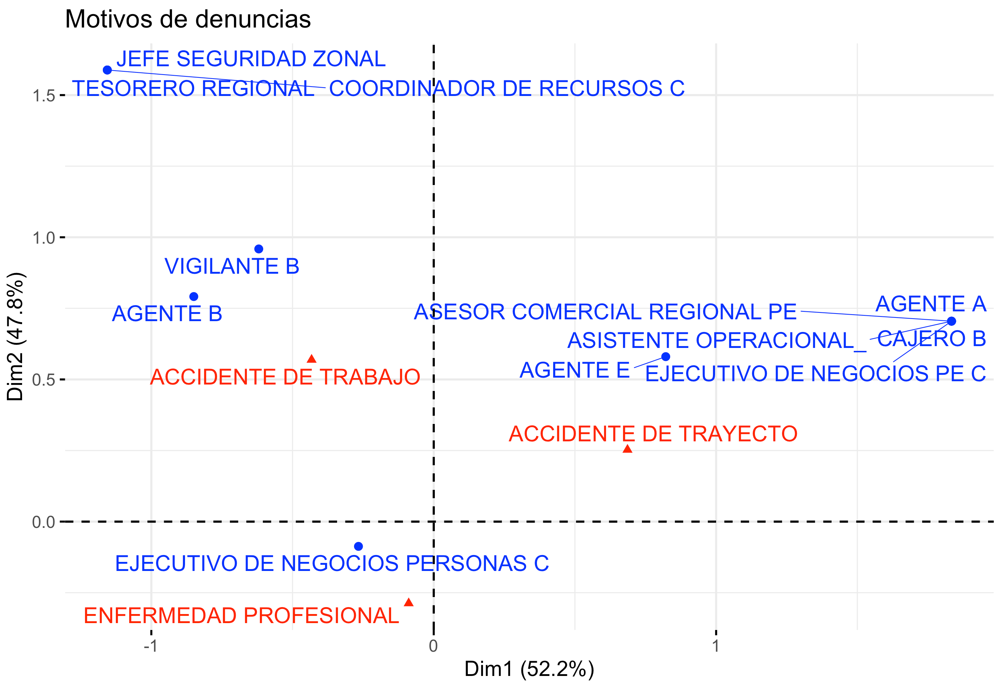
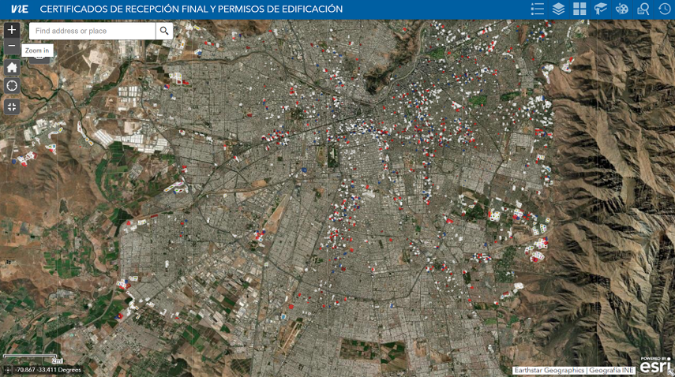

class: left, middle, bg_karl1, h1
## Retos y desafíos de la sociología

### Sebastián Massa Slimming
### 24 de octubre 2022


```{css, echo = F}
.bg_karl1 {
  position: relative;
  z-index: 1;
}

.bg_karl1::before {    
      content: "";
      background-image: url('https://images.theconversation.com/files/490334/original/file-20221018-4769-ep7hqv.gif?ixlib=rb-1.1.0&q=45&auto=format&w=1200&h=900.0&fit=crop');
      background-size: cover;
      position: absolute;
      top: 0px;
      right: 0px;
      bottom: 0px;
      left: 0px;
      opacity: 0.9;
      z-index: -1;
}

.h1 {
  color: white;
   font-size: 100%;
  text-shadow: 1px 1px 6px black, 0 0 25px blue, 0 0 5px darkblue
}

```

---

class: middle center bg_karl6 h6

# Contexto general

```{css, echo = F}

.bg_karl6 {
  position: relative;
  z-index: 1;
}

.bg_karl6::before {    
      content: "";
      background-image: url('https://funnel.mx/wp-content/uploads/2019/09/big-data-1.gif');
      background-size: cover;
      position: absolute;
      top: 0px;
      right: 0px;
      bottom: 0px;
      left: 0px;
      opacity: 0.9;
      z-index: -1;
}

.h6 {
  color: white;
  text-shadow: 2px 2px 4px #000000;
}

```
---
class: middle center bg_karl19 h19

# Hipótesis 

```{css, echo = F}

.bg_karl19 {
  position: relative;
  z-index: 1;
}

.bg_karl19::before {    
      content: "";
      background-image: url('http://static1.squarespace.com/static/57335c76e32140da77fac25e/57347375746fb911dba9ac3e/578a455ae58c62ac648f007b/1504631917337/anigif_longform-original-9187-1446141993-6.gif?format=1500w');
      background-size: cover;
      position: absolute;
      top: 0px;
      right: 0px;
      bottom: 0px;
      left: 0px;
      opacity: 0.9;
      z-index: -1;
}

.h19 {
  color: white;
  text-shadow: 2px 2px 4px #000000;
}

```


---
class: right, middle, inverse
# 1. ¿Dónde podemos aportar?


```{css, echo = FALSE}
.inverse {
  background-color: #272822;
  color: #d6d6d6;
  text-shadow: 0 0 20px #333;
}
```

---

# Aplicaciones de [text mining]()



]


---
# Aplicaciones de [text mining]()



---
# Aplicaciones de [text mining]()


---

.pull-left[
```{r, echo = FALSE, warning=FALSE, message=FALSE}

library(tm)
library(knitr)
library(kableExtra)

kast <- scan(file = "KAST_TXT.txt",
             fileEncoding = "UTF-8",
             what = "char",
             sep = "\n")

corpus_kast <- tm::Corpus(tm::VectorSource(kast)) 
corpus_kast <- tm::tm_map(corpus_kast, removeWords, stopwords("spanish"))
dtm_kast <- tm::TermDocumentMatrix(corpus_kast)
# tm::findFreqTerms(dtm_kast, lowfreq = 6)
cor_kast <- findAssocs(dtm_kast, terms = "ilegales", 
                       corlimit = 0.2)

kable(head(as.data.frame(cor_kast$ilegales), 16))

```
]

.pull-right[


]
---
class: right bg_karl14 h14
# Análisis de sentimiento

```{css, echo = F}

.bg_karl14 {
  position: relative;
  z-index: 1;
}

.bg_karl14::before {    
      content: "";
      background-image: url('https://www.rcharlie.com/images/blog/fitter-happier/fitter_happier_gif.gif');
      background-size: cover;
      position: absolute;
      top: 0px;
      right: 0px;
      bottom: 0px;
      left: 0px;
      opacity: 0.9;
      z-index: -1;
}

.h14 {
  color: black;
  text-shadow: 2px 2px 4px white;
}

```


---
class: right middle bg_karl10 h10
# Investigación de mercados

```{css, echo = F}

.bg_karl10 {
  position: relative;
  z-index: 1;
}

.bg_karl10::before {    
      content: "";
      background-image: url('https://www.rcharlie.com/images/blog/coachellar/3dplot.gif');
      background-size: cover;
      position: absolute;
      top: 0px;
      right: 0px;
      bottom: 0px;
      left: 0px;
      opacity: 0.9;
      z-index: -1;
}

.h10 {
  color: black;
  text-shadow: 2px 2px 4px white;
}

```

---
class: middle center bg_karl7 h7
# Aplicaciones web 

```{css, echo = F}

.bg_karl7 {
  position: relative;
  z-index: 1;
}

.bg_karl7::before {    
      content: "";
      background-image: url('https://livevox.com/wp-content/uploads/2022/01/BI-and-Performance-Analytics2.gif');
      background-size: cover;
      position: absolute;
      top: 0px;
      right: 0px;
      bottom: 0px;
      left: 0px;
      opacity: 0.9;
      z-index: -1;
}

.h7 {
  color: white;
  text-shadow: 2px 2px 4px #000000;
}

```


---

# Técnicas de [web scrapping]()


---
# Técnicas de [web scrapping]()


---

# Aplicaciones de [text mining]()


---
# Técnicas de [análisis multivariado]()

---

# Simulación matemática con [iteraciones]()

<iframe src="datable.html" style="border: 0; width: 100%; height: 60%""></iframe>

---

# Línea de código previa

```{r, eval = TRUE, warning= FALSE}

Simulacion_electoral <- function (votos, listas, n_escanos) {
  divisor.mat <- sum(votos)/sapply(votos, "/", seq(1, n_escanos, 1))
  colnames(divisor.mat) <- listas
  m.mat <- tidyr::gather(as.data.frame(divisor.mat), key = "nombre", 
                         value = "valor", everything())
  m.mat <- m.mat[rank(m.mat$valor, ties.method = "random") <= 
                 n_escanos,]
  rle.escanos <- rle(as.character(m.mat$nombre))
  if (sum(rle.escanos$length) != n_escanos) 
    stop(paste("Número de asientos distribuidos no es igual a", 
               n_escanos)) 
  rle.escanos$length
      }

Simulacion_electoral(votos = c(340000, 280000,160000), 
                     listas = c("Lista A", "Lista B", "Lista C"),
                     n_escanos = 7)


```

---
# Aplicaciones de [geolocalización]()



---

# Aplicaciones de [análisis de redes]()

<iframe src="highchart.html" style="border: 0; width: 100%; height: 80%""></iframe>

---

class: right, middle, inverse
# 2. ¿Qué retos tenemos hoy?


```{css, echo = FALSE}
.inverse {
  background-color: #272822;
  color: #d6d6d6;
  text-shadow: 0 0 20px #333;
}
```

---

class: middle center bg_karl18 h18

```{css, echo = F}

.bg_karl18 {
  position: relative;
  z-index: 1;
}

.bg_karl18::before {    
      content: "";
      background-image: url('https://img.thedailybeast.com/image/upload/c_crop,d_placeholder_euli9k,h_562,w_1000,x_0,y_0/dpr_2.0/c_limit,w_740/fl_lossy,q_auto/v1507750191/171011-Woodruff-Ackerman-cambridge-russia-scoop-hero_lkkx2o');
      background-size: cover;
      position: absolute;
      top: 0px;
      right: 0px;
      bottom: 0px;
      left: 0px;
      opacity: 0.9;
      z-index: -1;
}

.h18 {
  color: white;
  text-shadow: 2px 2px 4px #000000;
}

```

---

class: middle center bg_karl20 h20

```{css, echo = F}

.bg_karl20 {
  position: relative;
  z-index: 1;
}

.bg_karl20::before {    
      content: "";
      background-image: url('https://c.tenor.com/yGfc8apeh2UAAAAC/pills-drugs.gif');
      background-size: cover;
      position: absolute;
      top: 0px;
      right: 0px;
      bottom: 0px;
      left: 0px;
      opacity: 0.9;
      z-index: -1;
}

.h20 {
  color: white;
  text-shadow: 2px 2px 4px #000000;
}

```

---

class: middle center bg_karl18 h18

```{css, echo = F}

.bg_karl18 {
  position: relative;
  z-index: 1;
}

.bg_karl18::before {    
      content: "";
      background-image: url('https://img.thedailybeast.com/image/upload/c_crop,d_placeholder_euli9k,h_562,w_1000,x_0,y_0/dpr_2.0/c_limit,w_740/fl_lossy,q_auto/v1507750191/171011-Woodruff-Ackerman-cambridge-russia-scoop-hero_lkkx2o');
      background-size: cover;
      position: absolute;
      top: 0px;
      right: 20px;
      bottom: 0px;
      left: 0px;
      opacity: 1;
      z-index: -1;
}

.h18 {
  color: white;
  text-shadow: 2px 2px 4px #000000;
}

```

---

class: middle center bg_karl21 h21

```{css, echo = F}

.bg_karl21 {
  position: relative;
  z-index: 1;
}

.bg_karl21::before {    
      content: "";
      background-image: url('https://i0.wp.com/youarenotsosmart.com/wp-content/uploads/2013/05/bomberhit.gif');
      background-size: cover;
      position: absolute;
      top: 0px;
      right: 0px;
      bottom: 0px;
      left: 0px;
      opacity: 1;
      z-index: -1;
}

.h21 {
  color: white;
  text-shadow: 2px 2px 4px #000000;
}

```

---
class: middle center bg_karl21 h21


```{css, echo = F}

.bg_karl21 {
  position: relative;
  z-index: 1;
}

.bg_karl21::before {    
      content: "";
      background-image: url('https://i0.wp.com/youarenotsosmart.com/wp-content/uploads/2013/05/bomberhit.gif');
      background-size: cover;
      position: absolute;
      top: 0px;
      right: 0px;
      bottom: 0px;
      left: 0px;
      opacity: 1;
      z-index: -1;
}

.h21 {
  color: white;
  text-shadow: 2px 2px 4px #000000;
}

```

---
class: center, middle, inverse, h5, bg_karl5
# Conclusiones

```{css, echo = F}

.bg_karl2 {
  position: relative;
  z-index: 1;
}

.bg_karl2::before {    
      content: "";
      background-image: url('https://cdn.dribbble.com/users/31818/screenshots/5054596/gif-dribb.gif');
      background-size: cover;
      position: absolute;
      top: 0px;
      right: 0px;
      bottom: 0px;
      left: 0px;
      opacity: 0.9;
      z-index: -1;
}

.h3 {
  color: white;
  text-shadow: 2px 2px 4px #000000;
}

```

---

class: center, middle, bg_karl26, h6

# Los datos necesitan de la teoría para poder ser interpretados. 

```{css, echo = F}

.bg_karl26 {
  position: relative;
  z-index: 1;
}

.bg_karl26::before {    
      content: "";
      background-image: url('https://www.bu.edu/files/2019/06/DataScience-Header.gif');
      background-size: cover;
      position: absolute;
      top: 0px;
      right: 0px;
      bottom: 0px;
      left: 0px;
      opacity: 0.9;
      z-index: -1;
}

.h26 {
  color: white;
  text-shadow: 2px 2px 4px #000000;
}

```


---

class: center, middle, bg_karl25, h25

# En las dinámicas organizacionales, la conformación de equipos multidisciplinarios es muy útil.

```{css, echo = F}

.bg_karl25 {
  position: relative;
  z-index: 1;
}

.bg_karl25::before {    
      content: "";
      background-image: url('https://frogdesign.nyc3.cdn.digitaloceanspaces.com/wp-content/uploads/2020/11/24175415/20_Design-Mind_GDPR_Header-final.gif');
      background-size: cover;
      position: absolute;
      top: 0px;
      right: 0px;
      bottom: 0px;
      left: 0px;
      opacity: 0.9;
      z-index: -1;
}

.h25 {
  color: white;
  text-shadow: 2px 2px 4px #000000;
}

```

---

class: center, middle
# ¡Gracias!

```{r, echo = FALSE, eval = TRUE, warning = FALSE}
htmltools::tagList(rmarkdown::html_dependency_font_awesome())
```


